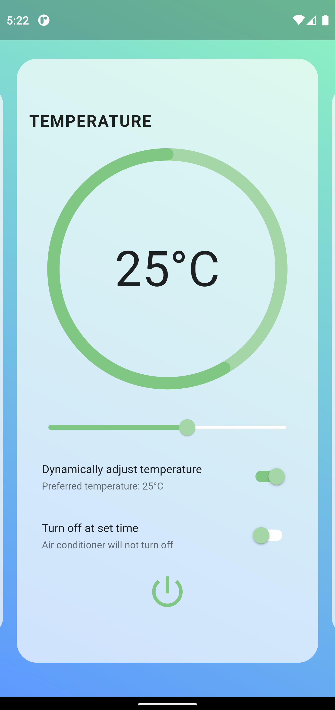
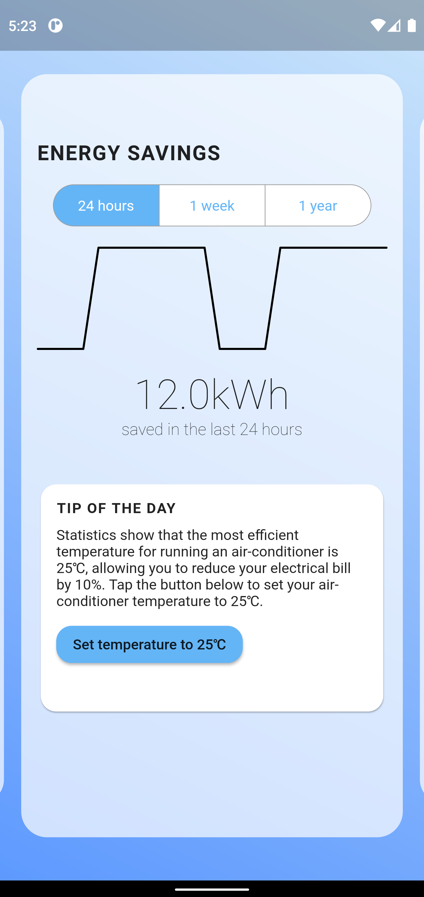
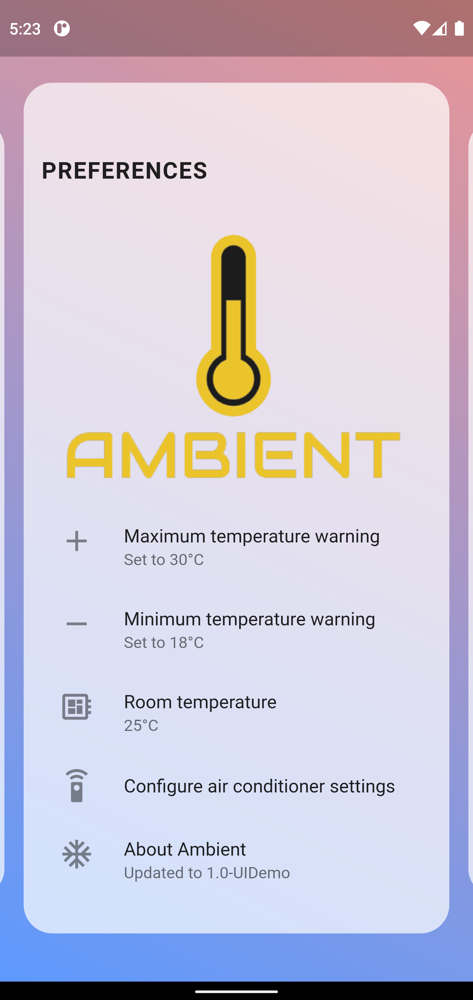

# About

Ambient is an app designed to tackle the problem of excessive energy consumption caused by air conditioning usage. It aims to assist users in managing their air conditioning usage by providing an intuitive user interface accessible through pairing the Ambient app with the Ambient Remote that is mounted near the air conditioning unit.

In recognition of its innovative features and potential to address energy conservation concerns, Ambient received second place in the 2020 3M InnoScience Challenge at the School of Science and Technology, Singapore.

# Features

- Control your air conditioning from anywhere using Wi-Fi
- Set timers to turn off air conditioning at specific times
- Set minimum and maximum temperature warnings when adjusting the temperature
- Automatic adjustment of the air conditioning temperature based on surrounding temperature
- Statistics page with estimated energy consumption and energy consumption trends
- Tips on reducing the energy consumption of air conditioning

# Read before downloading

The source code of Ambient in this repository has had all hardware-interfacing components commented out, so as to allow the testing of the Ambient App UI without the Ambient Remote. All public releases of Ambient in this repository are only demo versions and will not communicate with the server.

# Screenshots

    
    
    

# Compiling

For both iOS and Android, **Flutter 1.22.6** is recommended and has been tested to be working, since this app was last updated in November 2020.

### Android

The Android version requires Oracle Java SE 8 and Android Studio 4.1.1 to compile.

### iOS

The iOS app is able to compile with Xcode 14.2 and works fine on iOS 16.2.

# Credits

Ambient was created by Tan Xuan Han (leader), Tan Yu Zhe Richard, Laksh Madhavan and Leonidas Tan Jun Suan.